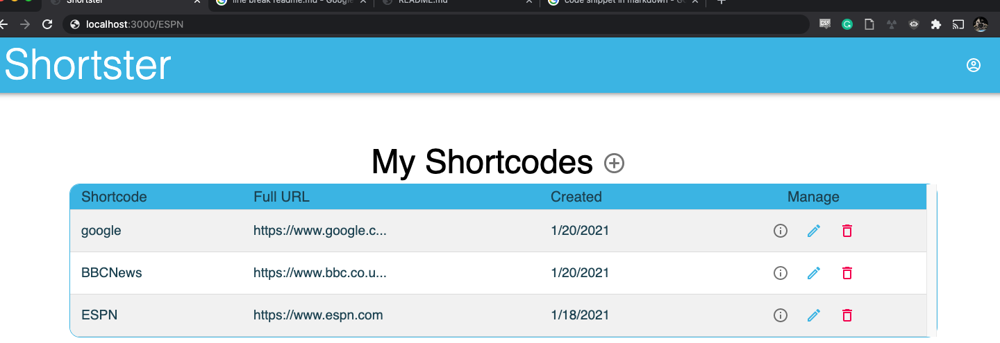
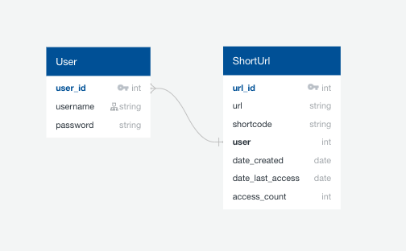
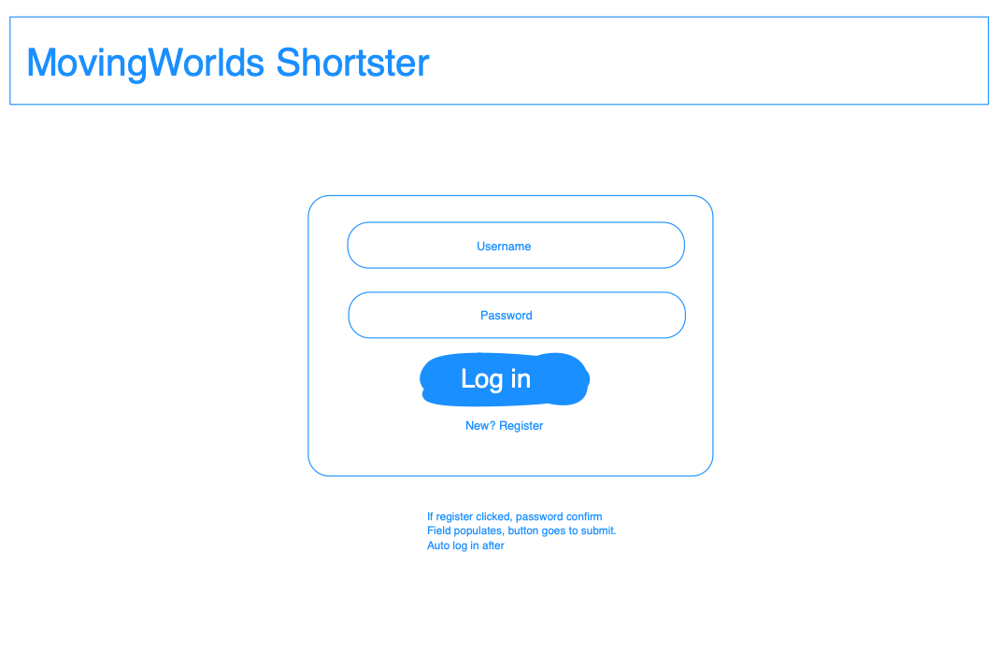
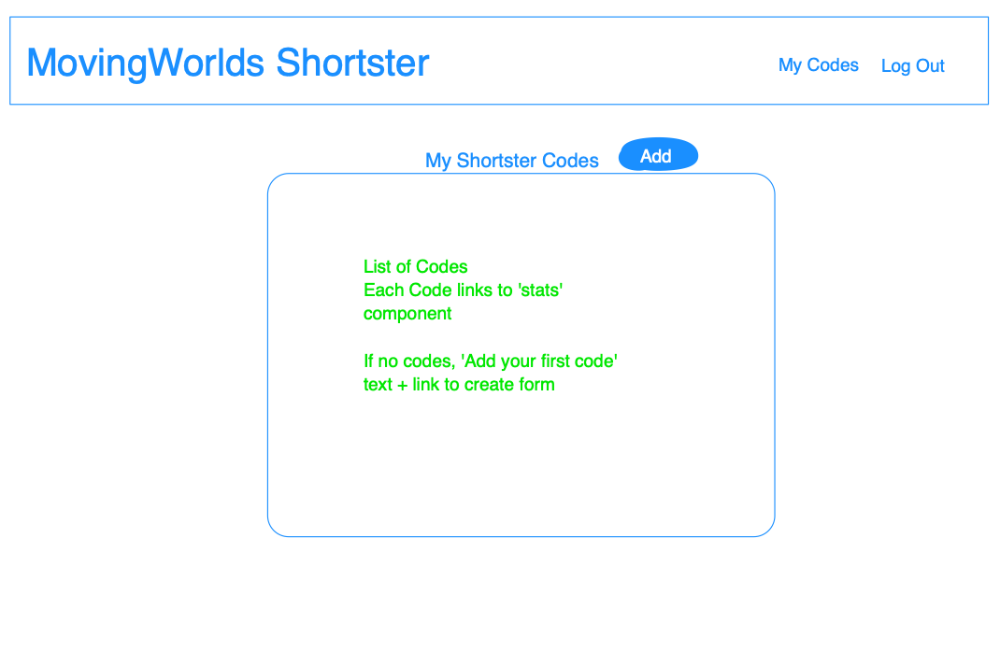
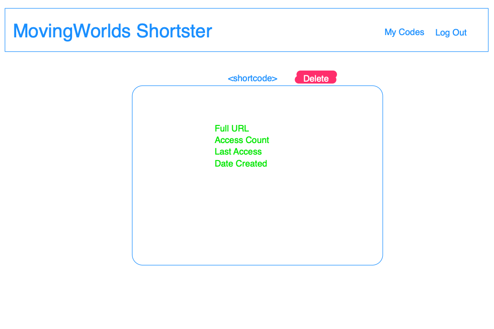
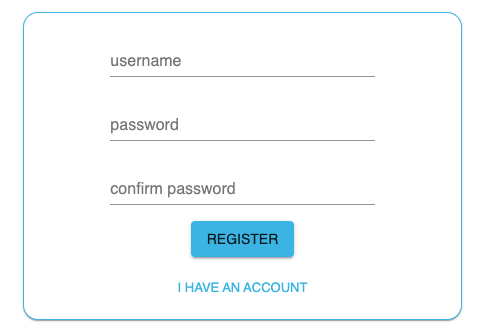
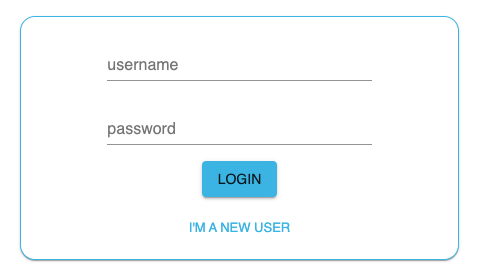
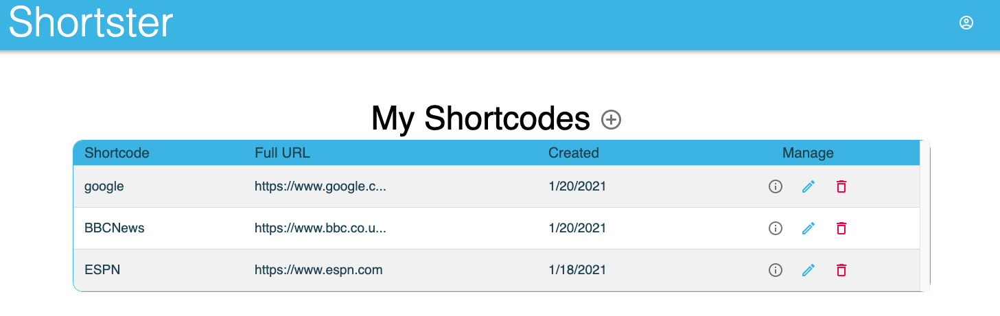
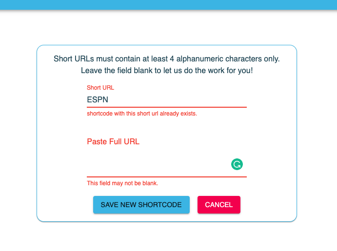
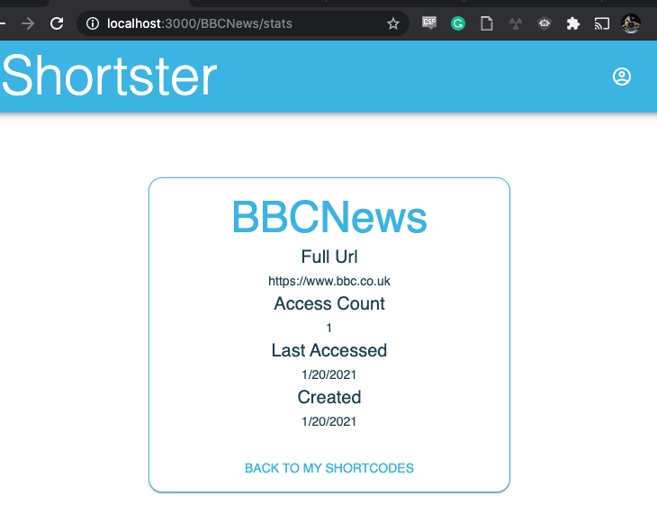

# Shortster

### Brief and User Stories

A coding challenge requiring an application that provides users with "short URLs" meeting the following specifications and endpoints:

*	A user can submit a URL and receive a unique shortcode in response.
*	A user can submit a URL and shortcode and will receive the chosen shortcode if it is available.
*	A user can access a '/:shortcode' endpoint and be redirected to the URL associated with that shortcode, if it exists.
*	All shortcodes can contain digits, upper case letters, and lowercase letters. It is case sensitive.
*	Automatically allocated shortcodes are exactly 6 characters long.
*	User submitted shortcodes must be at least 4 characters long.
*	A user can access a '/:shortcode/stats' endpoint in order to see when the shortcode was registered, when it was last accessed, and how many times it was accessed.

### Assumptions
* As I have not had experience creating shortcodes, I opted to generate strings that met the requirements listed so as to focus on creating a functional application. The resulting string can be appended to the development path and a user will be redirected given a valid URL. For example, the below would result in a redirect to "www.espn.com."

<br/>
<br/>

<div align='center'>

</div>

<br/>
<br/>

## Back End

#### Technologies
* Python
* Django / Django Rest Framework
* Pyjwt
* PostgreSQL / Psycopg
* Insomnia

#### Initial Database
<div align='center'>

</div>

#### Process

I boot-strapped this app with 'django-admin startproject.' With the basic file structure and settings in place, I adjusted the database to use PostgreSQL. Additionally, I created an Insomnia workspace to begin testing the endpoints and validations. The first model I created was the User model. For this, I utilized the Pyjwt library to handle webtoken encoding/decoding as well as Django Rest Frameworks built in authentication. With the code below, I am able to validate the token and format, as well as store the user info in the request to be accessed down the line. 

```python
class JWTAuthentication(BasicAuthentication):

    def authenticate(self, request):
        header = request.headers.get('Authorization')
        if not header:
            return None
        if not header.startswith('Bearer'):
            raise PermissionDenied(detail='Invalid Auth Token Format')

        token = header.replace('Bearer ', '')
        try:
            payload = jwt.decode(token, settings.SECRET_KEY, algorithms=['HS256'])
            user = User.objects.get(pk=payload.get('sub'))
        except jwt.exceptions.InvalidTokenError:
            raise PermissionDenied(detail='Invalid Auth Token')
        except User.DoesNotExist:
            raise PermissionDenied(detail='User Not Found')

        return (user, token)
```

Keeping a goal of simple and straightforward, I created only register and log in views/urls for the User model. In a more robust product, I would create additional model fields as well as views for users to maintain profiles along with the potential for other features. 

With the User model functioning in Insomnia, I began work on the Shortcode. I created fields I felt would address the user stories listed above. I included 2 methods on the model to increment the access_count and set the last_access date when appropriate.

```python
class Shortcode(models.Model):
    full_url = models.CharField(max_length=2000)
    short_url = models.CharField(max_length=100, unique=True)
    created = models.DateTimeField(auto_now_add=True)
    last_access = models.DateTimeField(null=True, blank=True)
    access_count = models.IntegerField(default=0)
    owner = models.ForeignKey(
        'jwt_auth.User',
        related_name='short_urls',
        on_delete=models.CASCADE
    )

    def add_access(self):
        self.access_count += 1

    def set_access_date(self):
        self.last_access = datetime.datetime.now()
```

I still have reservations about some of the naming conventions I selected. In retrospect I likely would have named the model something else so as to preserve shortcode. The views include list, stats and access views for a shortcode. A user, and only a user, has access to the list of their 'owned' shortcodes as well as the stats for a specific code. I added a third view for "access" to a code. This endpoint is accessible to any user. Upon each request, the code's last_access and access_count fields are updated. The full_url is returned so the frontend can redirect the user to the proper site.

```python
class CodeAccessView(CodeStatsView):
    ''' Requests to <short_url>/, redirect and inform stats '''

    def get(self, request, short_url):
        code = self.get_shortcode(short_url)
        code.add_access()
        code.set_access_date()
        code.save()
        serialized_code = CodeUpdateSerializer(code)
        return Response(serialized_code.data, status=status.HTTP_200_OK)
```

## Front End
* Javascript
* React / react-router-dom
* Http-proxy-middleware
* Axios
* Material UI Core & Icons

#### Initial Wireframes

Landing
<div align='center'>
  
</div>
Home
<div align='center'>
  
</div>
Stats
<div align='center'>
  
</div>

#### Process

With Skitch, I quickly laid out the initial component wireframes. I then began by setting up the file structure with 'create-react-app.' I then installed 'react-router-dom' as well as Material UI. I have been tinkering with MUI a bit and wanted to work a little more with a basic ThemeProvider and styled components. The default overrides are included in the theme.js file, with styled components contained in the 'src/elements' directory. In addition, I installed Axios for API request handling. 

The majority of time spent on the front end was working through how best to manage conditional rendering. The challenges I faced here involved immediately rendering a menu in the header once a user has logged in via the LoginForm component and updating the CodeList component when a user has successfully deleted a shortcode.

The resulting application should meet the specifications outlined in the project brief:

* a User Forms component to handle login and registration - Open to all users
* A Code Access component to handle accessing the shortcode link, and updating the Access Count and Last Access - Open to all users
* a Home component for the list of shortcodes
* a Stats component to view information for each shortcode
* A Code Forms component to handle create/update of shortcodes

User Form for registration and log in with field validation from backend and form error handling:
<div align='center'>
  
</div>
<div align='center'>
  
</div>

Shortcode List component for a user to view and manage their shortcodes (includes Delete function requiring confirmation):
<div align='center'>
  
</div>

Shortcode Create & Update form with character validation on the backend and form error handling:
<div align='center'>
  
</div>

Shortcode Stats component:
<div align='center'>
  
</div>

Finally, and most importantly, the Code Access (redirect) component. The below component will redirect given a shortcode stored in the database with a valid URL. As the component redirects, I have included the code below:

```javascript
import React, { useState, useEffect } from 'react'
import { Link, useParams } from 'react-router-dom'

import { accessShortCode } from '../../lib/api'

import Typography from '@material-ui/core/Typography'

const CodeAccess = () => {
  const { shortUrl } = useParams()
  const [errorStatus, setErrorStatus] = useState(null)

  useEffect(() => {
    const getCode = async () => {
      try {
        const response = await accessShortCode(shortUrl)
        const fullUrl = response.data.full_url
        window.location.href = fullUrl
      } catch (err) {
        setErrorStatus(err.response.status)
      }
    }
    getCode()
  }, [])

  return (
    <>
      {errorStatus === 404 && <Typography>Oh no, this link is not functioning. Click <Link to='/'>here</Link> to return to home.</Typography>}
      {!errorStatus && <Typography>Redirecting...</Typography>}
    </>
  )
}

export default CodeAccess
```

## Takeaways
This was a fun project to work on, and I appreciate the opportunity to do so. There are certainly a few areas I would like to dive deeper into to further refactor, most notably custom hooks and using Regex to validate the incoming full URLs. I will likely create a version 2 of this project to work on those aspects and continue to work with Material UI.